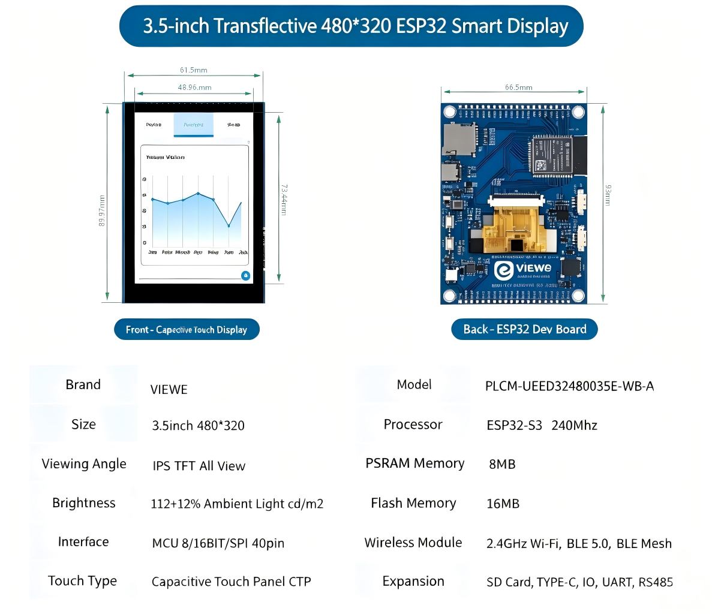
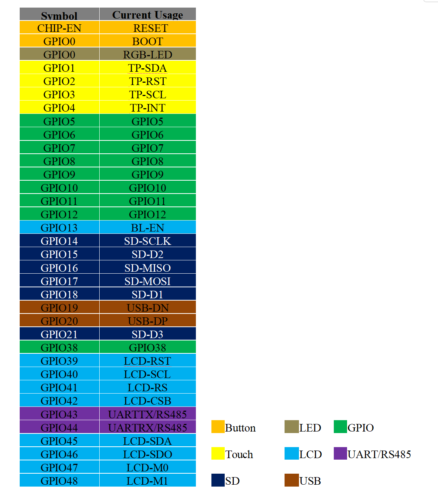

<h1 align="center">VIEWE 3.5" 320*480 ESP32-S3 Smart Display Quick Guide </h1>

* **[中文版](./README_CN.md)**

   

## 1. Introduction

UEED32480035E-WB-A is a high-performance smart display development board based on ESP32-S3. It is equipped with a 3.5-inch SPI transflective touch screen (320×480 resolution), whose screen remains clearly visible under sunlight, making it an ideal choice for outdoor devices. Designed by [VIEWE](https://viewedisplay.com/), this development board is suitable for IoT and outdoor Human-Machine Interface (HMI) application scenarios that require abundant peripheral interfaces as well as Wi-Fi / Bluetooth Low Energy connectivity.

> [!NOTE]
> The product model cannot be determined based on the PCB development board alone; the screen needs to be taken into consideration.
> UEDX24300028E-WB-A is a universal development board compatible with multiple displays, so product specifications shall be subject to the order.

### 1.1 Product Features

**CPU**

- Processor: Xtensa 32-bit LX7 dual-core, up to 240 MHz
- Integrated Wi-Fi 2.4 GHz (802.11 b/g/n) and Bluetooth 5 (LE) & BLE Mesh

**Memory**

- 8 MB PSRAM
- 16 MB Flash

**Peripheral Interfaces**

- Two 2×20 pin headers, breaking out multiple programmable GPIOs, supporting SPI, UART, I2C, I2S, LCD, Camera, USB OTG, and other interfaces
- On-board USB Type-C port for power supply, programming, and serial debugging (CH340C)
- On-board Micro SD card slot (SPI interface)
- Reset and Boot buttons

For more information on ESP32-S3-WROOM-1, please refer to the [ESP32-S3 datasheet](https://www.espressif.com/sites/default/files/documentation/esp32-s3_datasheet_en.pdf).

**Display**

- Size: 3.5 Inch
- Resolution: 320(W) × 3(RGB) × 480(H)
- Mode: MCU 8/16BIT / SPI
- Display mode: Transflective Normally BLACK
- Luminance  150 + 12% × surrounding illumination cd/m²
- Driver IC: ST7365 or Compatible
- Touch IC: CHSC6540
- Backlight Type: White LED

**Other**

- Operation Temperature: -20 ~ 70 ℃
- Storage Temperature: -30 ~ 80 ℃

### 1.2 Applications

With rich connectivity, powerful processing capabilities and outdoor-oriented reliability, UEED32480035E-WB-A is an ideal choice for outdoor-deployed IoT devices in the following areas:

- Outdoor Smart Control Panels
- Field Industrial Automation HMI
- Outdoor Smart Appliances
- Outdoor-rated Consumer Electronics
- Field Wireless Data Loggers
- Outdoor Touch Screen Interfaces
- Outdoor Educational Learning Platforms

## 2. Product Information

### 2.1 Interface Description

  

1. **Main Control Chip: ESP32-S3-N16R8**  
   Dual-core processor, up to 240 MHz operating frequency.

2. **Display Interface**  
   SPI interface adapted for 3.5-inch semi-transparent reflective screen, plug-and-play. See the Display Interface table below.

3. **UART Serial port**  
   It is recommended to use the matching HY1.25 4P-to-Dupont male header. The RS485 chip (MS1285, item 4) needs to be removed during use. This is a known limitation of this board.

4. **MS1285**  
   Transceiver chip applied to RS-485 communication systems.

5. **RS485 Serial port**  
   It is recommended to use the matching HY1.25 4P-to-Dupont male header.

6. **Active Buzzer**

7. **RGB-LED (WS2812B)**

8. **Boot Button**  
   BOOT button (GPIO0) for firmware download mode.

9. **Reset Button**  
   RESET button (CHIP-EN) for resetting the board.

10. **Power indicator light**

11. **USB Type-C interface**  
    Used for 5 V DC power supply, programming, and serial debugging.

12. **SD Card Slot**  
    SPI interface connected for external storage expansion.

13 / 14. **External GPIO Headers**  
    Dual-row headers providing access to a wide range of GPIOs, including ADC, touch sensors, and standard digital I/O.

> [!NOTE]
> Currently, the UART receive pin is overwritten by RS485. 
> If UART must be used: (1) use the extended pins for UART, or (2) remove the RS485 transceiver chip.

**Display Interface**

| Pin No. | Symbol | I/O | Description |
| :---: | :--- | :---: | :--- |
| 1 | XL / CTP-SCL | I | I2C clock for CTP; Option XL for RTP |
| 2 | YU / CTP-SDA | I | I2C data for CTP; Option YU for RTP |
| 3 | XR / CTP-RST | I | CTP reset, active low; Option XR for RTP |
| 4 | YD / CTP-INT | I/O | CTP interrupt; Option YD for RTP |
| 5 | GND | P | Power Ground |
| 6 | IOVCC | P | Power supply for I/O system |
| 7 | VCI | P | Power supply for analog circuits |
| 8 | TE | O | Tearing effect signal |
| 9 | SPI_CS / MCU_CS | I | Chip select, low-active |
| 10 | SPI_SCL / MCU_RS | I | SCL in SPI mode; RS in MCU interface |
| 11 | SPI_RS / MCU_WR | I | RS = 1 data; RS = 0 command. WR in MCU parallel |
| 12 | MCU_RD | I | Read enable in 8080 MCU parallel, low-active |
| 13 | SPI_SDA | I/O | SPI data I/O, internal pull-low |
| 14 | SPI_SDO | O | SPI output |
| 15 | RESET | I | LCM reset, active low |
| 16 | GND | P | Power Ground |
| 17–32 | DB0–DB15 | I/O | Data bus for MCU |
| 33 | LED-A | P | Backlight anode |
| 34–36 | LED-K | P | Backlight cathode |
| 37 | GND | P | Power Ground |
| 38 | IM0 | I | MCU interface mode select |
| 39 | IM1 | I | MCU interface mode select |
| 40 | IM2 | I | MCU interface mode select |

> [!NOTE]
> IM choice (`1` = pull up, `0` = pull down):
> `IM2 IM1 IM0`: **110** — 2.4 inch &nbsp;|&nbsp; **111** — 3.5 inch &nbsp;|&nbsp; **101** — 3.9 / 4.3 inch

### 2.2 GPIO Definition

## 3. Software

We will provide comprehensive support for **Arduino**, **PlatformIO**, and **ESP-IDF** frameworks, with pre-ported **LVGL** examples.

> [!TIP]
> Only **idf** examples are available at present, and other examples are being prepared. Please contact us if needed, and we will resolve your issues as soon as possible.

### 3.1 Getting Started

#### 4.2.1 Preparation
* **Hardware**: UEED32480035E-WB-A, USB-C Cable.
* **Software**: VS Code (ESP-IDF v5.3+) or Arduino IDE (v2.0+) or VS Code (PlatformIO).
* **Library**: The following libraries are needed for Arduino IDE and PlatformIO

    |Libraries|version|Description|
    | :--- | :--- | :--- |
    |`ESP32_Display_Panel`| `1.0.3+` |by Espressif, This is necessary to drive the screen.|
    |`ESP32_IO_Expander`| `Arduino automatic selection` |The dependency library of `ESP32_Display_Panel` should be selected for installation together during the installation process.|
    |`esp-lib-utils`| `Arduino automatic selection` |The dependency library of `ESP32_Display_Panel` should be selected for installation together during the installation process.|
    |`lvgl`| `8.4.0` | A free and open-source embedded graphics library. |

#### 4.2.2  ESP-IDF Setup

For detailed procedures, please refer to the esp-idf example folder at [README.md](examples/esp_idf/UEED_28_lvgl_port/README.md) or [README_CN.md](examples/esp_idf/UEED_28_lvgl_port/README_CN.md). The general steps are as follows:

1.  **Open platformio example**
    * go to GitHub to download the program. You can download the main branch by clicking on the "<> Code" with green text
    * Open the example using VS Code(ESP-IDF)
2.  **Compile and upload**:
    * Click `build` in the upper right corner to compile.
    * connect the microcontroller to the computer.If the compilation is correct.
    * Click `upload` in the upper right corner to download.

## 4. Related Downloads

**Specification & datasheets**

- [UEED32480035E-WB-A V1.0 SPEC](datasheet/UEED32480035E-WB-A%20V1.0%20SPEC.pdf)
- [Schematic](Schematic/UEDX24320028E-WB-A%20V1.1%20sch.pdf)
- [CHSC6540 Touch IC](datasheet/DS_CHSC6540_V1.0%20Datasheet.pdf)
- [WS2812B RGB LED](datasheet/C2843785_RGB%2BLED(Built-in%20IC)_XL-5050RGBC-WS2812B_specification_WJ1123912.PDF)
- [Buzzer HYG-8503A](datasheet/C7544813_Buzzer_HYG-8503A_specification_WJ436381.PDF)
- [CH340C](datasheet/C84681_USB%20Conversion%20chip_CH340C_specification_WJ1187874.PDF)

### 3.3 Firmware Download (Manual Flash)

If you need to flash a pre‑compiled binary manually:

1.  Open the “Flash Download Tool” (available in the tools folder or from Espressif’s website).
2.  Select the chip type (**ESP32‑S3**) and the correct download method.
3.  Load the firmware files from the `firmware` folder and configure the offsets as described in the firmware readme.
4.  Connect the board and start the download.  
    *If flashing fails, hold down the **BOOT** button while powering on, then retry.*

    
    

## FAQ

* Q. After reading the above tutorials, I still don't know how to build a programming environment. What should I do?
* A. If you still don't understand how to build an environment after reading the above tutorials, you can refer to the [VIEWE-FAQ]() document instructions to build it.

 

* Q. Why does Arduino IDE prompt me to update library files when I open it? Should I update them or not?
* A. Choose not to update library files. Different versions of library files may not be mutually compatible, so it is not recommended to update library files.

 

* Q. Why is there no serial data output on the "Uart" interface on my board? Is it defective and unusable?
* A. The default project configuration uses the USB interface as Uart0 serial output for debugging purposes. The "Uart" interface is connected to Uart0, so it won't output any data without configuration. For PlatformIO users, please open the project file "platformio.ini" and modify the option under "build_flags = xxx" from "-D ARDUINO_USB_CDC_ON_BOOT=true" to "-D ARDUINO_USB_CDC_ON_BOOT=false" to enable external "Uart" interface. For Arduino users, open the "Tools" menu and select "USB CDC On Boot: Disabled" to enable the external "Uart" interface.

 

* Q. Why is my board continuously failing to download the program?
* A. Please hold down the "BOOT" button and try downloading the program again.

Technical support: smartrd1@viewedisplay.com &nbsp;|&nbsp; [viewedisplay.com](https://viewedisplay.com/)
