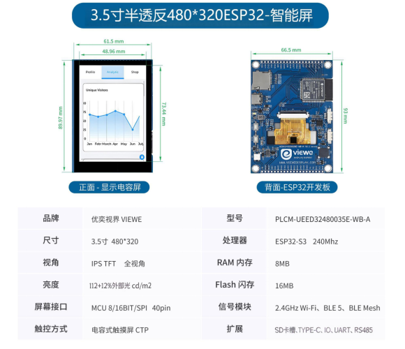
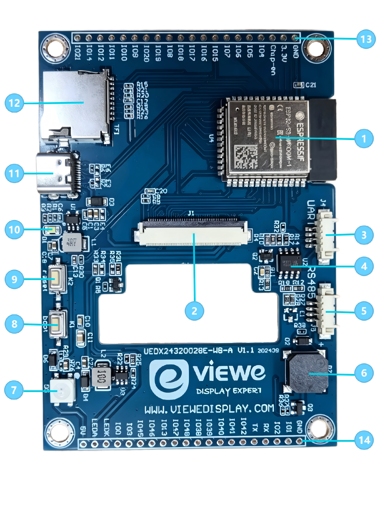

<h1 align="center">VIEWE 3.5" 320*480 ESP32-S3 智能显示屏快速指南</h1>

* **[English Version](./README.md)**

   

## 1. 简介

UEED32480035E-WB-A 是一款基于 ESP32-S3 的高性能智能显示开发板，搭载 3.5 英寸 SPI 半透半反触摸屏（分辨率 320×480）。屏幕在阳光下仍可清晰显示，适合户外设备。由 [优奕视界 VIEWE](https://viewedisplay.com/) 设计，适用于需要丰富外设接口以及 Wi-Fi / 低功耗蓝牙连接的物联网与户外人机交互（HMI）场景。

> [!NOTE]
> 不能仅凭 PCB 开发板判断产品型号，需要结合屏幕一起确认。
> UEDX24300028E-WB-A 是一块可兼容多种屏幕的通用开发板，产品规格以订单为准。

### 1.1 产品特性

**CPU**

- 处理器：Xtensa 32 位 LX7 双核，主频最高 240 MHz
- 集成 2.4 GHz Wi-Fi（802.11 b/g/n）以及 Bluetooth 5 (LE) 与 BLE Mesh

**存储器**

- 8 MB PSRAM
- 16 MB Flash

**外设接口**

- 两组 2×20 排针，引出可编程 GPIO，支持 SPI、UART、I2C、I2S、LCD、Camera、USB OTG 等接口
- 板载 USB Type-C，用于供电、下载与串口调试（CH340C）
- 板载 Micro SD 卡槽（SPI）
- Reset、Boot 按键

ESP32-S3-WROOM-1 详细资料见 [ESP32-S3 数据手册](https://www.espressif.com.cn/sites/default/files/documentation/esp32-s3_datasheet_en.pdf)。

**显示屏**

- 尺寸：3.5 英寸
- 分辨率：320(W) × 3(RGB) × 480(H)
- 接口：MCU 8/16BIT / SPI
- 显示模式：半透半反 Normally BLACK
- 亮度：150 + 12% × 环境照度 cd/m²
- 驱动 IC：ST7365 或兼容型号
- 触摸 IC：CHSC6540
- 背光：白色 LED

**其他**

- 工作温度：-20 ~ 70 ℃
- 储存温度：-30 ~ 80 ℃

### 1.2 应用场景

凭借丰富连接能力、较强处理性能以及面向户外的可靠性，UEED32480035E-WB-A 适用于以下户外物联网场景：

- 户外智能控制面板
- 现场工业自动化 HMI
- 户外智能家电
- 户外消费电子
- 现场无线数据采集器
- 户外触摸交互界面
- 户外教学实验平台

## 2. 产品信息

### 2.1 接口说明

  

1. **主控芯片：ESP32-S3-N16R8**  
   双核处理器，工作频率最高 240 MHz。

2. **显示接口**  
   SPI 接口，适配 3.5 英寸半透半反屏，即插即用。具体引脚见下方 Display Interface 表。

3. **UART 串口**  
   建议使用配套 HY1.25 4P 转杜邦公头。使用时需拆除编号 4 的 RS485 芯片（MS1285）。此为本板当前已知限制。

4. **MS1285**  
   用于 RS-485 通信的收发芯片。

5. **RS485 串口**  
   建议使用配套 HY1.25 4P 转杜邦公头。

6. **有源蜂鸣器**

7. **RGB-LED（WS2812B）**

8. **Boot 按键**  
   BOOT（GPIO0），进入固件下载模式。

9. **Reset 按键**  
   RESET（CHIP-EN），复位开发板。

10. **电源指示灯**

11. **USB Type-C**  
    用于 5 V 直流供电、下载与串口调试。

12. **SD 卡槽**  
    SPI 接口，用于外部存储扩展。

13 / 14. **外部 GPIO 排针**  
    双排排针，引出 ADC、触摸及普通数字 IO 等 GPIO。

> [!NOTE]
> 当前 UART 接收脚被 RS485 占用。
> 如必须使用 UART：（1）改用扩展排针上的 UART；或（2）拆除 RS485 收发芯片。

**显示接口**

| 引脚 | 符号 | I/O | 说明 |
| :---: | :--- | :---: | :--- |
| 1 | XL / CTP-SCL | I | CTP 的 I2C 时钟；RTP 时为 XL |
| 2 | YU / CTP-SDA | I | CTP 的 I2C 数据；RTP 时为 YU |
| 3 | XR / CTP-RST | I | CTP 复位，低有效；RTP 时为 XR |
| 4 | YD / CTP-INT | I/O | CTP 中断；RTP 时为 YD |
| 5 | GND | P | 电源地 |
| 6 | IOVCC | P | IO 系统供电 |
| 7 | VCI | P | 模拟电路供电 |
| 8 | TE | O | 撕裂效应同步信号 |
| 9 | SPI_CS / MCU_CS | I | 片选，低有效 |
| 10 | SPI_SCL / MCU_RS | I | SPI 模式下为 SCL；MCU 接口下为 RS |
| 11 | SPI_RS / MCU_WR | I | RS=1 数据，RS=0 命令；MCU 并口为 WR |
| 12 | MCU_RD | I | 8080 MCU 并口读使能，低有效 |
| 13 | SPI_SDA | I/O | SPI 数据输入输出，内部下拉 |
| 14 | SPI_SDO | O | SPI 输出 |
| 15 | RESET | I | 液晶复位，低有效 |
| 16 | GND | P | 电源地 |
| 17–32 | DB0–DB15 | I/O | MCU 数据总线 |
| 33 | LED-A | P | 背光正极 |
| 34–36 | LED-K | P | 背光负极 |
| 37 | GND | P | 电源地 |
| 38 | IM0 | I | MCU 接口模式选择 |
| 39 | IM1 | I | MCU 接口模式选择 |
| 40 | IM2 | I | MCU 接口模式选择 |

> [!NOTE]
> IM 选择（`1` 上拉，`0` 下拉）：
> `IM2 IM1 IM0`：**110** — 2.4 英寸 &nbsp;|&nbsp; **111** — 3.5 英寸 &nbsp;|&nbsp; **101** — 3.9 / 4.3 英寸

### 2.2 GPIO 定义

## 3. 软件

我们将为 **Arduino**、**PlatformIO** 和 **ESP-IDF** 框架提供完整支持，并预置已移植的 **LVGL** 示例。

> [!TIP]
> 目前仅提供 **ESP-IDF** 示例，其他示例正在准备中。如有需要请联系我们，我们会尽快协助解决。

### 3.1 快速上手

#### 4.2.1 准备工作

* **硬件**：UEED32480035E-WB-A、USB-C 数据线。
* **软件**：VS Code（ESP-IDF v5.3+），或 Arduino IDE（v2.0+），或 VS Code（PlatformIO）。
* **库文件**：Arduino IDE 和 PlatformIO 需要安装以下库

    | 库 | 版本 | 说明 |
    | :--- | :--- | :--- |
    | `ESP32_Display_Panel` | `1.0.3+` | Espressif 提供，驱动屏幕所必需。 |
    | `ESP32_IO_Expander` | `Arduino 自动选择` | `ESP32_Display_Panel` 的依赖库，安装时请一并安装。 |
    | `esp-lib-utils` | `Arduino 自动选择` | `ESP32_Display_Panel` 的依赖库，安装时请一并安装。 |
    | `lvgl` | `8.4.0` | 免费开源的嵌入式图形库。 |

#### 4.2.2 ESP-IDF 环境配置

详细步骤请参考 ESP-IDF 示例目录中的 [README.md](examples/esp_idf/UEED_28_lvgl_port/README.md) 或 [README_CN.md](examples/esp_idf/UEED_28_lvgl_port/README_CN.md)。大致流程如下：

1.  **打开示例**
    * 前往 GitHub 下载程序。点击绿色的 “<> Code” 即可下载 main 分支
    * 使用 VS Code（ESP-IDF）打开示例
2.  **编译并烧录**：
    * 点击右上角 `build` 进行编译。
    * 编译通过后，将开发板连接到电脑。
    * 点击右上角 `upload` 进行下载。

## 4. 相关下载

**规格书与芯片资料**

- [UEED32480035E-WB-A V1.0 规格书](datasheet/UEED32480035E-WB-A%20V1.0%20SPEC.doc)
- [电路图](Schematic/UEDX24320028E-WB-A%20V1.1%20sch.pdf)
- [CHSC6540 触摸 IC](datasheet/DS_CHSC6540_V1.0%20Datasheet.pdf)
- [WS2812B RGB LED](datasheet/C2843785_RGB%2BLED(Built-in%20IC)_XL-5050RGBC-WS2812B_specification_WJ1123912.PDF)
- [蜂鸣器 HYG-8503A](datasheet/C7544813_Buzzer_HYG-8503A_specification_WJ436381.PDF)
- [CH340C](datasheet/C84681_USB%20Conversion%20chip_CH340C_specification_WJ1187874.PDF)

### 3.3 固件下载（手动烧录）

如需手动烧录预编译固件：

1.  打开 “Flash Download Tool”（位于 `tools` 目录，或从乐鑫官网获取）。
2.  选择芯片类型（**ESP32-S3**）以及正确的下载方式。
3.  加载 `firmware` 文件夹中的固件文件，并按固件说明配置偏移地址。
4.  连接开发板并开始下载。  
    *若烧录失败，上电时按住 **BOOT** 键后再重试。*

    
    

## FAQ

* Q. 看完上面的教程，我还是不会搭建开发环境，怎么办？
* A. 如果按照上述教程仍无法完成环境搭建，可参考 [VIEWE-FAQ]() 文档进行操作。

 

* Q. Arduino IDE 打开时提示更新库文件，要不要更新？
* A. 请选择不更新。不同版本的库文件可能互不兼容，不建议更新。

 

* Q. 开发板上的 “Uart” 接口没有串口数据输出，是不是坏了？
* A. 默认工程配置使用 USB 作为 Uart0 调试输出。“Uart” 接口同样接到 Uart0，未配置时不会有数据输出。 PlatformIO 用户请打开工程文件 `platformio.ini`，将 `build_flags = xxx` 下的 `-D ARDUINO_USB_CDC_ON_BOOT=true` 改为 `-D ARDUINO_USB_CDC_ON_BOOT=false`，以启用外部 “Uart” 接口。 Arduino 用户请在 “Tools” 菜单中选择 “USB CDC On Boot: Disabled”，以启用外部 “Uart” 接口。

 

* Q. 开发板一直烧录失败怎么办？
* A. 请按住 “BOOT” 键后重新尝试下载。

技术支持：smartrd1@viewedisplay.com &nbsp;|&nbsp; [viewedisplay.com](https://viewedisplay.com/)
